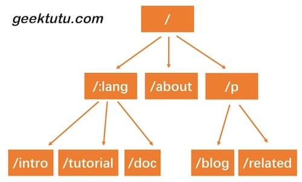

1. 在之前的代码中，使用map存储路由表，key为method-path,value是对应的控制方法。索引搞笑，但是只能索引静态路由
```go
//router.go
type router struct {
	handlers map[string]HandlerFunc
}
```
对于某些动态路由(一条动态规则可以匹配一种类型而非一条固定的路由)的需求,如`/hello/:name`可以匹配`hello/gee`、`hello/xiaoli`等,该如何处理？  
对于动态路由的不同实现方法，
* 如路由实现gorouter支持在路由规则中嵌入正则表达式，如`/p/[0-9a-zA-Z]+`,即路径中参数仅匹配数字和字母  
* 如路由实现`httprouter`不支持正则表达式。
* 实现动态路由的最常见数据结构，被称为Trie数。


在图中的前缀树，可以表示如下路由规则：
* /:lang/doc 
* /:lang/tutorial 
* /:lang/intro 
* /about 
* /p/blog 
* /p/related
http请求的路径由/分割为多段，每段可以作为前缀树的一个节点。通过树结构查询，进行路由的匹配。
对于路由来说，注册节点和节点的匹配是重要的功能。对于注册节点规则，映射handler；对于访问节点时，匹配路由规则
，查找到对应的handler。因此，Trie树需要支持节点的插入和查询。  
对于插入功能的实现，需要递归查找每一层的节点，不匹配则新建。  
对于查询功能的实现，同样需要递归查找。 
Trie数具有基本的插入和查找功能后，就可以应用到路由中。
### Router
使用roots存储每种请求方式的Trie树根结点。使用handlers存储每种请求方式的HandlerFunc.


## 分组
分组控制 Route Group Control,对路由分组。如果没有路由分组，我们需要针对每一个路由进行控制。在业务场景中，某一组路由需要相似的处理。如：
* /post 路由你名可访问
* /adimin 需鉴权
* /api RESTful接口，可以对接第三方平台，需要三方平台鉴权。
## 中间件
由于此功能改动较小，因此不再新建文件夹。  
中间件其实与路由映射Handler一致，处理的输入的Context对象。插入点是框架接收到请求初始化对象Context对象后，允许用户使用自定义中间件扩展功能，如记录日志、对Context
二次加工等。  
另外，通过调用`(*Context).Next()`,中间件可等待用户自定义对Handler处理结束后，再进行额外操作，如计算本次处理所用时间等。  
即Gee对中间件支持用户在请求被处理对前后进行一些额外的操作。也可以设置多个中间件，依次调用。  
* 在路由的分组控制中，中间件定义在GroupRouter中，应用在最顶层的Group，相当于作用于全局，所有请求都会被中间件处理，那么为什么不作用在每一条路由规则上？  
作用在某条路由规则，不如用户直接在Handler中调用更直观，且通用性太差。
* 对于中间件对设计，接收请求后寻找中间件，保存在Context中依次调用，那么为什么调用后还需要保存在Context上？
因为在设计中，中间件不仅作用在处理流程前，也可以作用在处理流程后。用户自定义Handler处理完毕后，还可以再执行剩下的操作

## 模版Template
支持服务端渲染。  
对于js/css等静态文件的渲染支持，可以使用分组路由控制来实现。如，将静态文件放在/usr/web下，那么filepath就是相对该路径的地址，映射到对应的静态文件。  
net/http中已经实现了如何返回静态文件，那么我们只需实现解析地址和文件的映射。  
对于模版渲染来说，使用go语言内置的html/template模版库，包括普通变量渲染、模版渲染、列表渲染。  
关于fileserver： https://studygolang.com/articles/33920


## 错误处理机制
比较常见的错误是error，由用户决定后续的处理，当错误严重时也会触发panic。  
defer可以在panic或程序退出之前正常运行，执行后退出。  
recover在defer中运行，避免因panic而导致整个程序的终止。  
> 要编写一个测试文件，需要创建一个名称以 _test.go 结尾的文件，该文件包含 TestXxx 函数，如上所述。 将该文件放在与被测试文件相同的包中。该文件将被排除在正常的程序包之外，但在运行 go test 命令时将被包含。
测试函数的签名必须接收一个指向 testing.T 类型的指针，并且不能返回任何值。函数名最好是 Test + 要测试的方法函数名。

一旦panic，可能就会使整个路由框架宕机。因此使用中间件，加入错误处理。